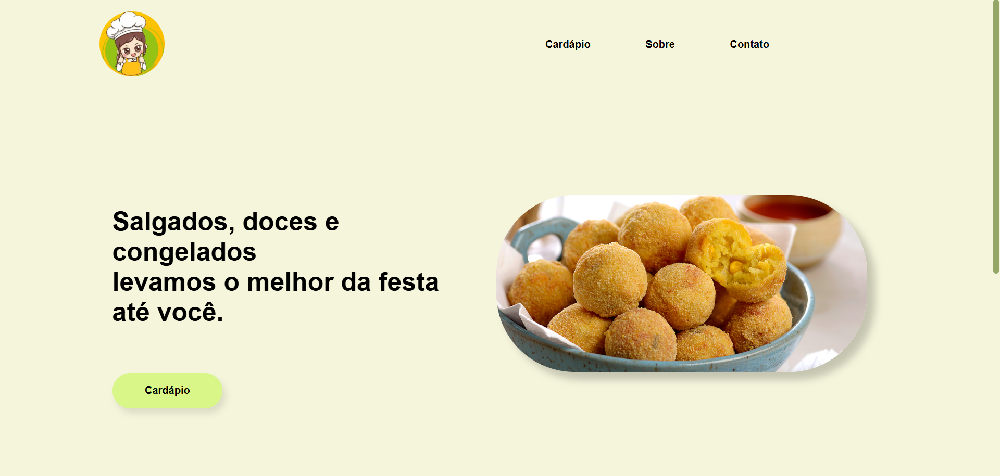
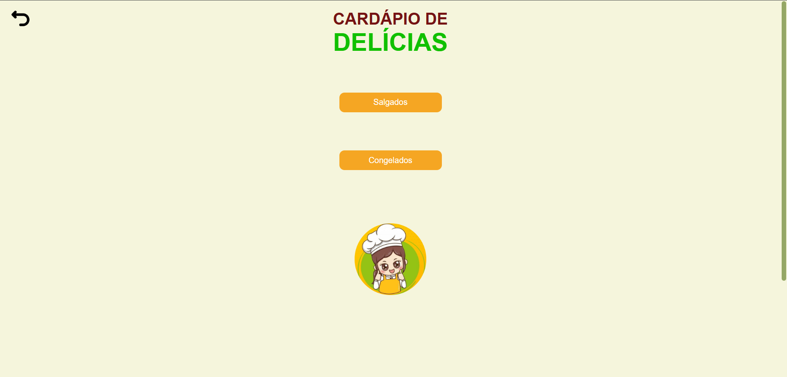
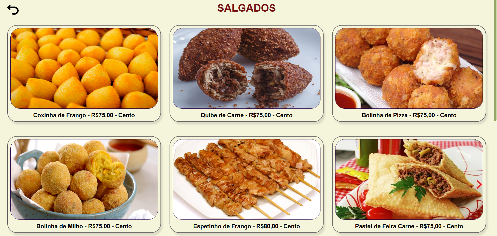
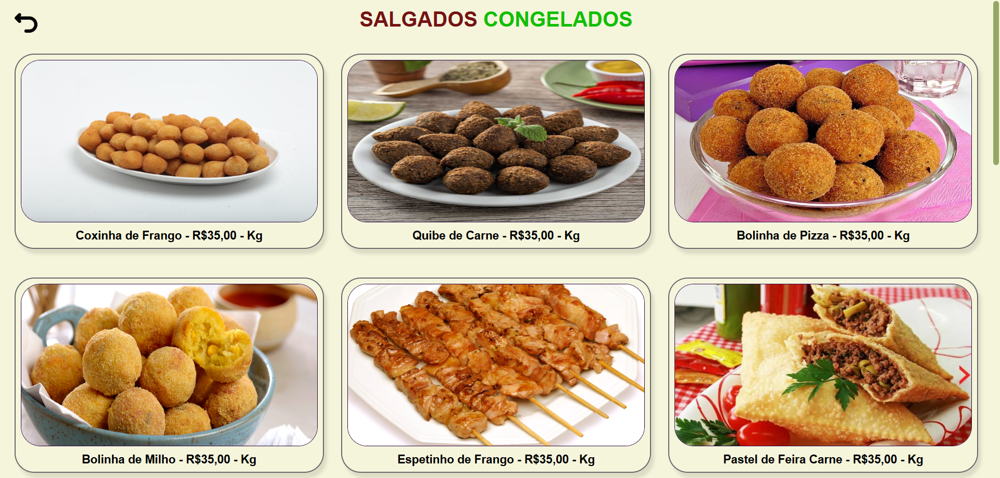
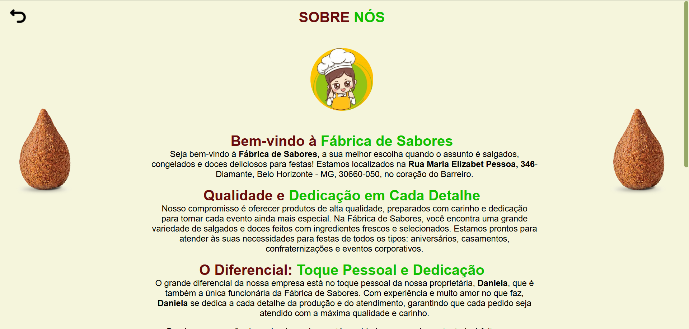

# **Site de Comida**

Este é um projeto escolar desenvolvido como parte de um trabalho de **empreendedorismo social**. O site foi criado utilizando as seguintes tecnologias:

- **HTML** (Estrutura)
- **CSS** (Estilo)
- **MySQL** (Banco de dados)
- **JavaScript** (Interatividade)
- **PHP** (Backend)

## **Tecnologias Utilizadas**

- **HTML/CSS**: Para a construção e estilização da interface do usuário.
- **MySQL**: Para armazenamento de dados, como informações de usuários e produtos.
- **JavaScript**: Para funcionalidades interativas no frontend.
- **PHP**: Para gerenciamento do backend e conexão com o banco de dados.

## **Confira o Projeto**  
<a href="https://fabrica-de-sabores.netlify.app/">Confira o projeto aqui</a>

##

## **Imagens do Projeto**

  
  
  
  
  

